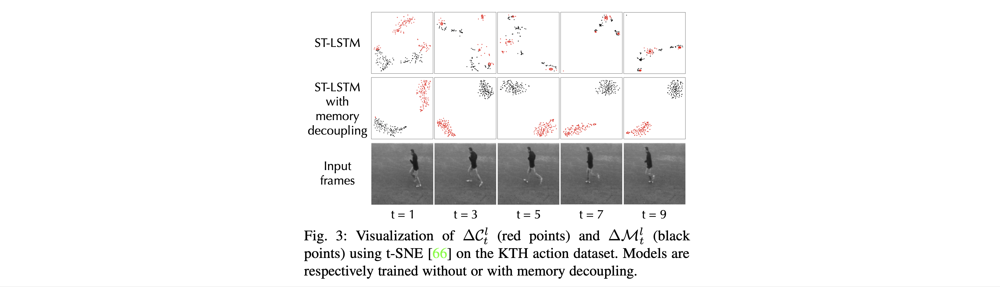
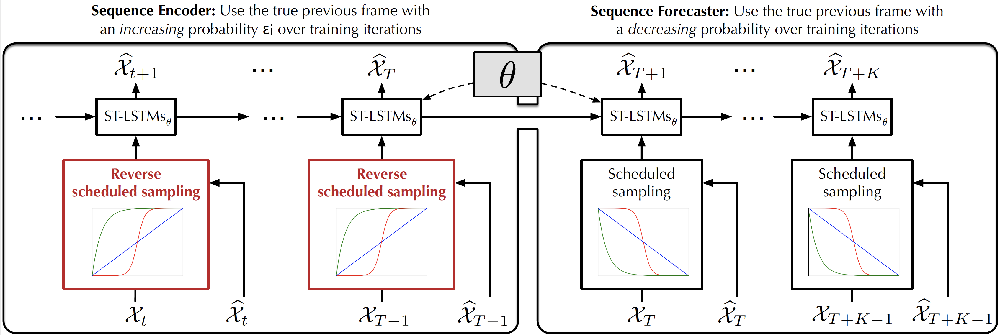
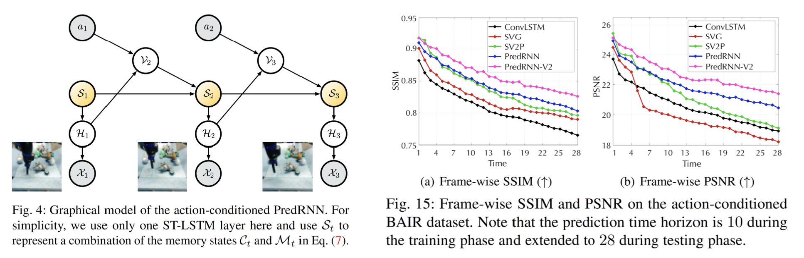
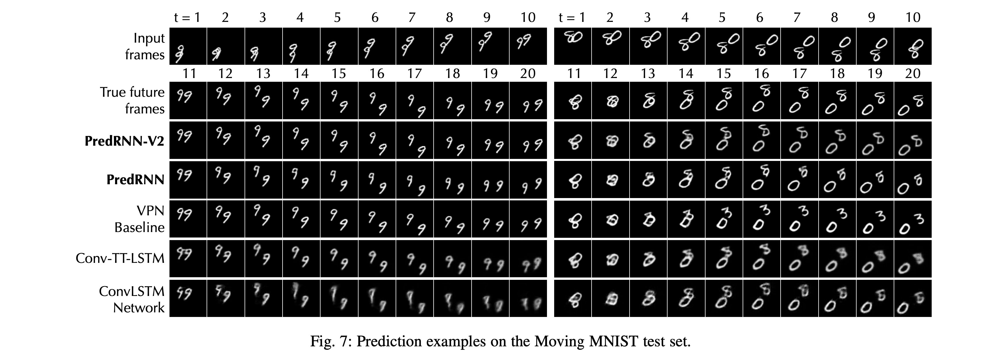
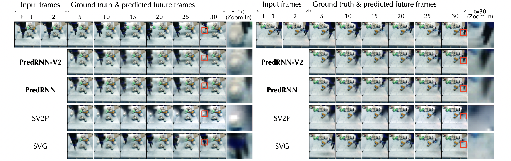
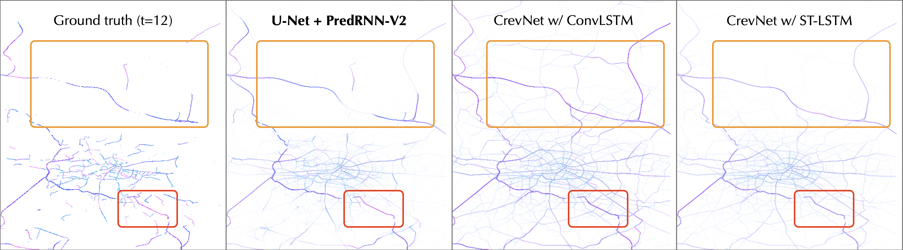
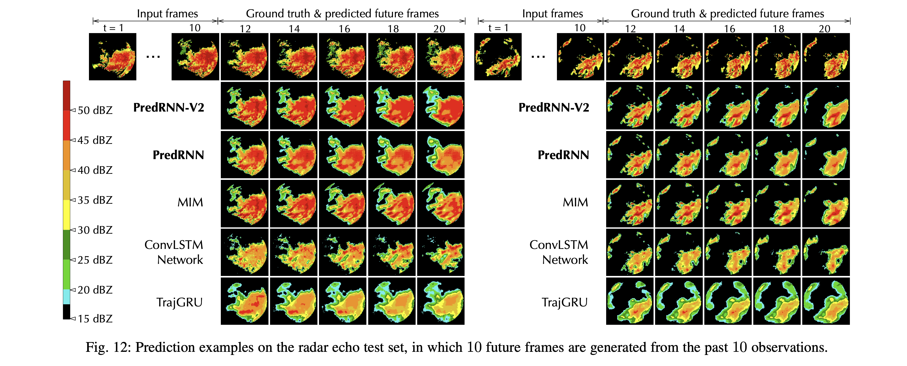
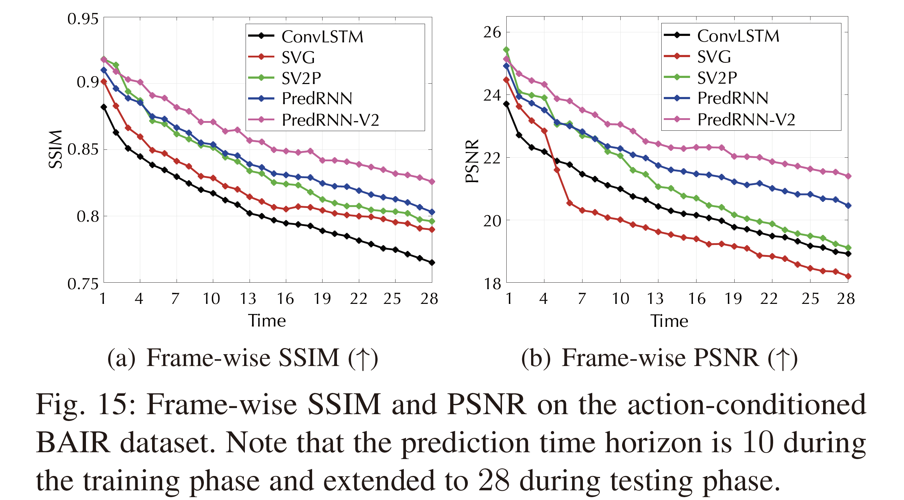

# PredRNN: A Recurrent Neural Network for Spatiotemporal Predictive Learning (TPAMI 2022)

The predictive learning of spatiotemporal sequences aims to generate future images by learning from the historical context, where the visual dynamics are believed to have modular structures that can be learned with compositional subsystems.

## Initial version at NeurIPS 2017

This repo first contains a PyTorch implementation of **PredRNN** (2017) [[paper](https://papers.nips.cc/paper/6689-predrnn-recurrent-neural-networks-for-predictive-learning-using-spatiotemporal-lstms)], a recurrent network with a pair of memory cells that operate in nearly independent transition manners, and finally form unified representations of the complex environment.

Concretely, besides the original memory cell of LSTM, this network is featured by a zigzag memory flow that propagates in both bottom-up and top-down directions across all layers, enabling the learned visual dynamics at different levels of RNNs to communicate.

## New in PredRNN-V2 at TPAMI 2022

This repo also includes the implementation of **PredRNN-V2** [[paper](https://arxiv.org/pdf/2103.09504.pdf)], which improves PredRNN in the following three aspects.


#### 1. Memory-Decoupled ST-LSTM

We find that the pair of memory cells in PredRNN contain undesirable, redundant features, and thus present a memory decoupling loss to encourage them to learn modular structures of visual dynamics. 



#### 2. Reverse Scheduled Sampling

Reverse scheduled sampling is a new curriculum learning strategy for seq-to-seq RNNs. As opposed to scheduled sampling, it gradually changes the training process of the PredRNN encoder from using the previously generated frame to using the previous ground truth. **Benefit:** It forces the model to learn long-term dynamics from context frames. 

[comment]: <>

#### 3. Action-Conditioned Video Prediction

We further extend PredRNN to action-conditioned video prediction. By fusing the actions with hidden states, PredRNN and PredRNN-V2 show highly competitive performance in long-term forecasting. They are potential to serve as the base dynamic model in model-based visual control.

We show quantitative results on the BAIR robot pushing dataset for predicting 28 future frames from 2 observations.



## Showcases

Moving MNIST



KTH


BAIR (We zoom in on the area in the red box)



Traffic4Cast



Radar echoes



## Quantitative results on Moving MNIST and KTH in LPIPS

LPIPS is more sensitive to perceptual human judgments, the lower the better.

|        | Moving MNIST | KTH action |
|  ----  | ----   | ---- |
| PredRNN  | 0.109 | 0.204 |
| PredRNN-V2  | 0.071 | 0.139 |

## Quantitative results on Traffic4Cast (Berlin)

|                  | MSE (10^{-3}) |
| ---------------- | --------------------- |
| U-Net            | 6.992                 |
| CrevNet          | 6.789                 |
| U-Net+PredRNN-V2 | **5.135**             |

[comment]:<## Quantitative results on the action-conditioned BAIR dataset>

[comment]:<Frame-wise SSIM and PSNR for the predicted future 28 frames.>

[comment]:<>


## Get Started

1. Install Python 3.6, PyTorch 1.9.0 for the main code. Also, install Tensorflow 2.1.0 for BAIR dataloader.

2. Download data. This repo contains code for three datasets: the [Moving Mnist dataset](https://onedrive.live.com/?authkey=%21AGzXjcOlzTQw158&id=FF7F539F0073B9E2%21124&cid=FF7F539F0073B9E2), the [KTH action dataset](https://drive.google.com/drive/folders/1_M1O4TuQOhYcNdXXuNoNjYyzGrSM9pBF?usp=sharing), and the BAIR dataset (30.1GB), which can be obtained by:

   ```
   wget http://rail.eecs.berkeley.edu/datasets/bair_robot_pushing_dataset_v0.tar
   ```

3. Train the model. You can use the following bash script to train the model. The learned model will be saved in the `--save_dir` folder.
  The generated future frames will be saved in the `--gen_frm_dir` folder.

4. You can get **pretrained models** from [Tsinghua Cloud](https://cloud.tsinghua.edu.cn/d/72241e0046a74f81bf29/) or [Google Drive](https://drive.google.com/drive/folders/1jaEHcxo_UgvgwEWKi0ygX1SbODGz6PWw).
```
cd mnist_script/
sh predrnn_mnist_train.sh
sh predrnn_v2_mnist_train.sh

cd kth_script/
sh predrnn_kth_train.sh
sh predrnn_v2_kth_train.sh

cd bair_script/
sh predrnn_bair_train.sh
sh predrnn_v2_bair_train.sh
```

## Citation

If you find this repo useful, please cite the following papers.
```
@inproceedings{wang2017predrnn,
  title={{PredRNN}: Recurrent Neural Networks for Predictive Learning Using Spatiotemporal {LSTM}s},
  author={Wang, Yunbo and Long, Mingsheng and Wang, Jianmin and Gao, Zhifeng and Yu, Philip S},
  booktitle={Advances in Neural Information Processing Systems},
  pages={879--888},
  year={2017}
}

@misc{wang2021predrnn,
      title={{PredRNN}: A Recurrent Neural Network for Spatiotemporal Predictive Learning}, 
      author={Wang, Yunbo and Wu, Haixu and Zhang, Jianjin and Gao, Zhifeng and Wang, Jianmin and Yu, Philip S and Long, Mingsheng},
      year={2021},
      eprint={2103.09504},
      archivePrefix={arXiv},
}
```

